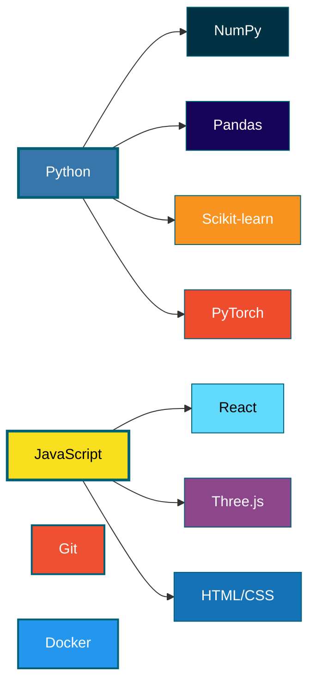

<p align="center">
  
</p>

<div align="center">
  
</div>

---

</div>

## 👋 About

Data Science student here! That's pretty much all that you need to know :)

<div align="center">

---

</div>

## Currently Exploring

```
→ Causal Inference
→ Snowflake/ spark
→ Systems Design
→ Mathematical Foundations (never stopped doing this)
```

<div align="center">

---

</div>

## Tech Stack



**Core:** Python · JavaScript · PyTorch · React · Three.js · Git · Docker

<div align="center">

---

</div>

## Activity & Contributions

<p align="center">
  
</p>

<p align="center">
  
</p>

<div align="center">

---


</div>

## 🔗 Connect

<p align="center">
  <a href="https://thedarkiin.github.io/portfolio/">
    
  </a>
  <a href="mailto:asermouhyassin@gmail.com">
    
  </a>
</p>

<div align="center">

---

</div>

<p align="center">
  
</p>
