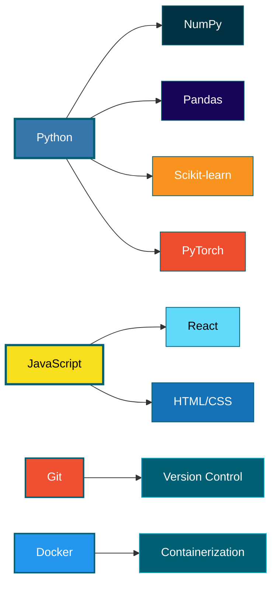

<!-- Ocean header -->
<p align="center">
  
</p>

<p align="center">
  
</p>

<div align="center">

---

</div>

## 👋 About

Data Science student at **INSEA** (Rabat, Morocco). I always seek building systems not only that think clearly — code that's reproducible, mathematically rigorous, and built almost to last. Obsessed (WOWOW not that much hhh) with understanding *how* things work, not just *that* they work. Curiosity-driven: mathematics, physics, psychology... ALL type of sciences actually. When not coding: solo free climbs, playing volleyball, contemplating the sea, movies, anime sometimes, plenty of eating, someone stop me already LOL.

<div align="center">

---

</div>

## 🎯 Currently Exploring

```
→ Causal Inference
→ Neural Networks & Deep Learning
→ Systems Design & Architecture
→ Mathematical Foundations (always)
```

<div align="center">

---

</div>

## 💡 How i work

I believe in:
- **Reproducibility first** — Deterministic pipelines, decoupled codebase, separate env
- **Mathematical rigor** — Math is the foundation
- **Testing everything** — Small, fast tests catch bugs early
- **Systems thinking** — ML is part of larger ecosystems

<div align="center">

---

</div>

## 🛠️ Tech Stack



**Core:** Python · JavaScript · PyTorch · React · Git · Docker

<div align="center">

---

</div>

## 📊 Activity & Contributions

<p align="center">
  
</p>

<p align="center">
  
</p>

<p align="center">
  
</p>

<div align="center">

---

</div>

## 🎲 Interests & Outside Code

**Physical:** Climbing (free climbs), Volleyball, Calisthenics  
**Mental:** Gaming, Strategy, Philosophy  
**Natural:** Ocean, Mountains, Thinking deeply

<div align="center">

---

</div>

## 🔗 Connect

<p align="center">
  <a href="https://thedarkiin.github.io/portfolio/">
    
  </a>
  <a href="mailto:asermouhyassin@gmail.com">
    
  </a>
  <a href="https://github.com/Thedarkiin">
    
  </a>
</p>

<div align="center">

---

</div>

<p align="center">
  
</p>
