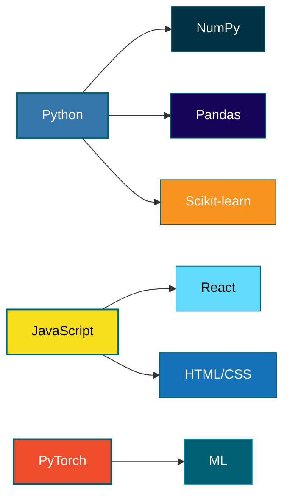

<!-- Ocean header -->

  

  

---

## Tech Stack

```mermaid
graph LR
    A["Python"] --> B["NumPy"]
    A --> C["Pandas"]
    A --> D["Scikit-learn"]
    
    E["JavaScript"] --> F["React"]
    E --> G["HTML/CSS"]
    
    H["PyTorch"] --> I["ML"]
    
    style A fill:#3776AB,stroke:#005f73,color:#fff,stroke-width:2px
    style B fill:#013243,stroke:#005f73,color:#fff
    style C fill:#150458,stroke:#005f73,color:#fff
    style D fill:#F7931E,stroke:#005f73,color:#fff
    style E fill:#F7DF1E,stroke:#005f73,color:#000,stroke-width:2px
    style F fill:#61DAFB,stroke:#005f73,color:#000
    style G fill:#1572B6,stroke:#005f73,color:#fff
    style H fill:#EE4C2C,stroke:#005f73,color:#fff,stroke-width:2px
    style I fill:#005f73,stroke:#00B4D8,color:#fff
```

---

## Contact

  
  
  

---

  

