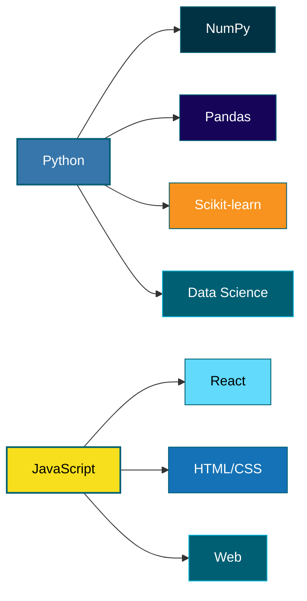

<!-- Ocean header -->

  

  

---

## 🧠 What I Work With

---

## 💻 Tech Stack

  
  
  
  
  
  

  
  
  

---

## 📊 Work

7-8 projects across data science & web development. 

Building things that matter.

---

## 📍 About

Data Science student at INSEA. I value clarity, mathematical rigor, and reproducible code.  
Curiosity drives my work — I study mathematics, physics, and human cognition. Outside of study: climbing, volleyball, calisthenics, gaming, and the sea.

---

## 🔗 Contact

  
  
  

---

  

