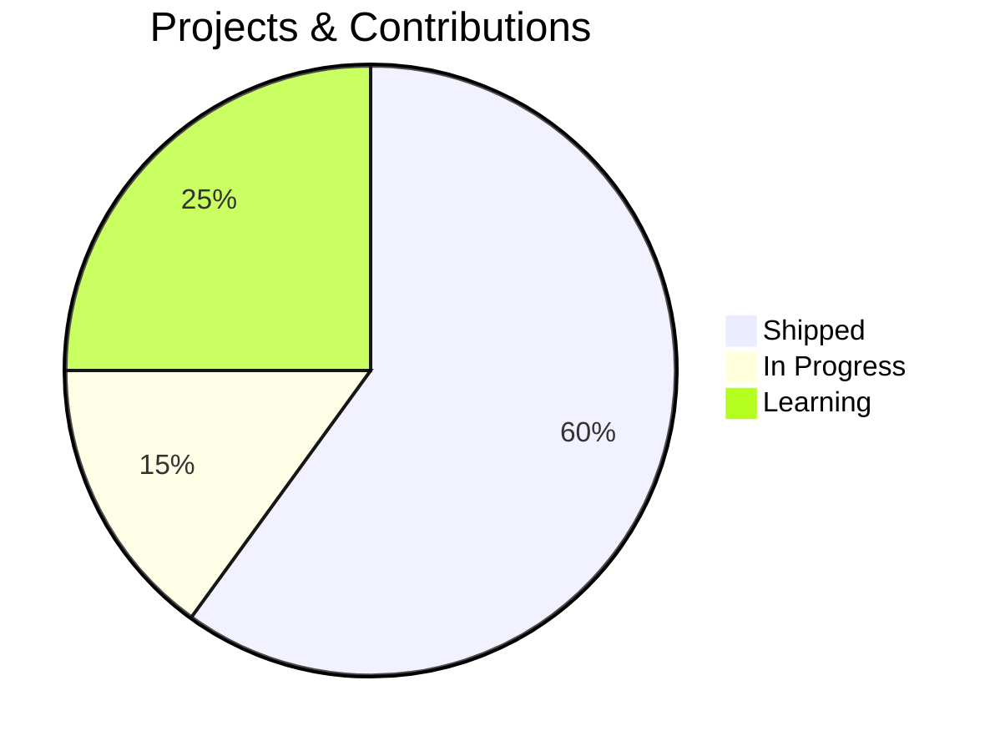

<!-- Ocean header -->
<p align="center">
  
</p>

<p align="center">
  
</p>

---

## 🎯 Tech Stack (Interactive Diagram)

```mermaid
graph LR
    A["🧠 Core"] --> B["Python"]
    A --> C["PyTorch"]
    A --> D["JavaScript"]
    A --> E["React"]
    
    B --> F["NumPy"]
    B --> G["Pandas"]
    B --> H["Scikit-learn"]
    
    C --> I["Deep Learning"]
    C --> J["Neural Networks"]
    
    D --> K["Frontend"]
    E --> K
    
    F -.→ L["Data Science"]
    G -.→ L
    H -.→ L
    I -.→ L
    J -.→ L
    
    style A fill:#00B4D8,stroke:#005f73,color:#fff
    style F fill:#3776AB,stroke:#005f73,color:#fff
    style G fill:#150458,stroke:#005f73,color:#fff
    style H fill:#F7931E,stroke:#005f73,color:#fff
    style I fill:#EE4C2C,stroke:#005f73,color:#fff
    style J fill:#EE4C2C,stroke:#005f73,color:#fff
    style K fill:#61DAFB,stroke:#005f73,color:#000
    style L fill:#005f73,stroke:#00B4D8,color:#fff
```

---

## 📊 Proficiency Matrix

<table align="center">
<tr>
<td>

| Skill | Level |
|:---:|:---:|
| Python | ████████░ 95% |
| PyTorch | ███████░░ 85% |
| JavaScript | ████████░ 90% |
| SQL | ███████░░ 88% |
| React | ███████░░ 82% |

</td>
<td>

| Skill | Level |
|:---:|:---:|
| NumPy/Pandas | █████████ 92% |
| Data Science | █████████ 93% |
| Web Stack | ███████░░ 87% |
| Mathematics | █████████ 95% |
| Systems Design | ████████░ 89% |

</td>
</tr>
</table>

---

## 🔄 Learning Journey (Animated Diagram)

```mermaid
graph TD
    A["📚 Learning<br/>Fundamentals"] --> B["🛠️ Building<br/>Projects"]
    B --> C["⚙️ Systems<br/>Design"]
    C --> D["📈 Scaling<br/>Production"]
    D --> E["🚀 Innovation<br/>Next Wave"]
    E -.→ A
    
    style A fill:#001219,stroke:#00B4D8,color:#fff
    style B fill:#003049,stroke:#00B4D8,color:#fff
    style C fill:#005f73,stroke:#00B4D8,color:#fff
    style D fill:#00B4D8,stroke:#005f73,color:#000
    style E fill:#005f73,stroke:#00B4D8,color:#fff
```

---

## 🛠️ Tech Badges

<p align="center">
  
  
  
  
  
  
</p>

<p align="center">
  
  
  
  
</p>

<p align="center">
  
  
  
  
</p>

---

## 📈 Stats Dashboard



---

## 💡 Core Skills

```
┌─────────────────────────────────────┐
│                                     │
│  ✓ Numerical methods               │
│  ✓ Applied mathematics             │
│  ✓ Time series & forecasting       │
│  ✓ Model evaluation                │
│  ✓ Reproducible pipelines          │
│  ✓ Clean modular code              │
│  ✓ Feature engineering             │
│  ✓ Systems thinking                │
│                                     │
└─────────────────────────────────────┘
```

---

## 📍 About

Data Science student at INSEA. I value clarity, mathematical rigor, and reproducible code.  
Curiosity drives my work — I study mathematics, physics, and human cognition. Outside of study: climbing, volleyball, calisthenics, gaming, and the sea.

---

## 📊 Stats

<p align="center">
  
  
  
  
</p>

---

## 🔗 Contact

<p align="center">
  <a href="https://thedarkiin.github.io/portfolio/">
    
  </a>
  <a href="mailto:asermouhyassin@gmail.com">
    
  </a>
  <a href="https://github.com/Thedarkiin">
    
  </a>
</p>

---

<p align="center">
  
</p>

<p align="center">
  
</p>
